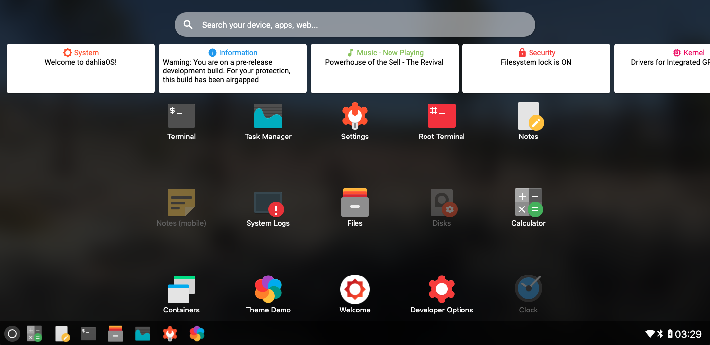

# Pangolin Desktop [Zircon][Linux]
Pangolin is the main desktop UI for dahliaOS. It was the earliest component of dahliaOS to be developed. As of v200614.1, Pangolin has been available by default as the desktop in Linux-based builds. 
Try it out here - [web.dahliaos.io](https://web.dahliaos.io)
## History - Significant changes
+ February 27, 2019, Camden Bruce announced the beginning of dahliaOS [Source - Reddit](https://www.reddit.com/r/Fuchsia/comments/av6tja/fuchsia_fork_dahlia_os/)
+ March 2, 2019, Camden Bruce created the repository pangolin-desktop 
+ March 4, 2019, Noah Cain uploaded the first basic code for the desktop in a (now deprecated) custom codebase. 
+ April 5, 2019, Horus125 Begain importing some components from capybara for use within Pangolin
+ May 11, 2019, A basic calculator application was added to the system
+ May 17, 2019, A Text editor called "Petal" was merged into Pangolin
+ June 30, 2019, The launcher was given an updated look featuring cards, was not yet functional
+ May 26, App icons were finally added to the launcher, they were not yet functional
+ May 31, 2020, User @kanouharu implemented a basic app launching ability to the panel icons
+ June 6, 2020, a basic task manager was implemented
+ June 12, 2020, @SincerelyFaust migrated the codebase to Apache 2.0 rather than the GPL, the beginning of dahliaOS' transistion to Apache.
+ June 20, 2020, @larsb24 made significant changes to the backend as well as improving the quicksettings. 
+ June 22, 2020, FleshRoots added support for automatic building through (gitlab CI?)

Please note that these are only the highlights from development, and not indicative of every commit. If you find something left out, please feel free to add it.

## Components

### The Desktop


The desktop is the location of windows, widgets(planned), and the wallpaper.

### The Panel


The panel is the hub for application launching and managing settings.

### The Launcher


The launcher is for opening and viewing a grid of every application in the system, as well as a list of quick, helpful cards that display notifications and information. A search bar is also available to sort through apps, find settings, and search the web. 

### The Quick Settings Menu


Quick settings assists in changing relevant system settings quickly (hence the name), offering an easier and more efficient method of changing settings than opening the app.


## Development

### TL;DR, for Linux:
```bash
flutter channel master # Set flutter to master channel
flutter upgrade # Upgrade to master channel
flutter config --enable-linux-desktop # Add Linux as a target
git clone https://github.com/dahlia-os/pangolin-desktop pangolin_desktop # Clone the repo
cd pangolin_desktop
flutter create . # Optional, but updates the embedder code
flutter run -d linux
```

### Developing Pangolin for dahliaOS Linux-Based builds

While pre-compiled builds can be found in the dahliaOS-overlays folder, you can also compile Pangolin and include them in the Buildroot toolchain

#### Prerequisites

To develop for dahliaOS Linux-Based, you will need the `flutter` tool, and a compiled base config from dahlia-os/buildroot. Compiling the base config will take about 6 hours. Once finished, copy the dahliaOS overlays into the buildroot/output/target directory, and then go to the pangolin_desktop directory. Open up a terminal, and type `flutter build linux --release` to generate a release build. Copy the output bundle files (located under build/release/) to `buildroot/output/target/dahlia/pangolin`, and compile the image file again to include it. 
