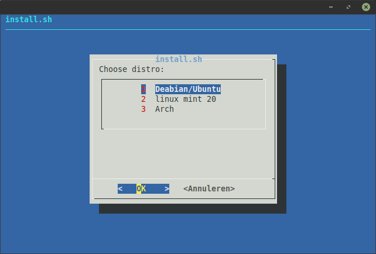

<p align="center">
  <a href="https://www.dahliaos.io">
    
  </a>

  <br>
    <h1 align="center"><center>Documentation</center></h1>
  <br>

<p align="center">
  <a href="supported-hardware.md">
    
  </a>
  <a href="hardware">
    
  </a>
  <a href=".github/CONTRIBUTING.md">
    
  </a>
  <a href="https://dahliaos.io/donate/">
    
  </a>
</p>

<h2 align="center">
    <b>How to make a bootable USB</b> 
    </h2>
<br />

- Find [here](run%20DahliaOS/x86_64-efi.md) instructions for running dahliaOS on 64-bit efi system.

- For older 64-bit legacy systems go to [here](run%20DahliaOS/) for instructions.

<h2 align="center">
    <b>Run dahlia in QEMU</b> 
    </h2>
<br />

<h3 align="center">
    <b>Arch</b>
</h3>

- First open a terminal and type the following command:
```
sudo pacman -S qemu qemu-arch-extra qemu-block-gluster qemu-block-iscsi qemu-block-rbd samba
```

- Then download the dahliaos iso from: https://github.com/dahlia-os/releases/releases 

- Then type the following command in the terminal (make sure that you use the right name of the ISO file. DahliaOS.iso is just for this example)
```
qemu-system-x86_64 -cdrom Downloads/DahliaOS.iso -m 1024
```

<h3 align="center">
    <b>Ubuntu 18.04</b>
</h3>

- First open a terminal and type the following command:
```
sudo apt-get install qemu-kvm qemu virt-manager virt-viewer libvirt-bin
```
- Then download the dahliaos iso from: https://github.com/dahlia-os/releases/releases 

- Then type the following command in the terminal (make sure that you use the right name of the ISO file. DahliaOS.iso is just for this example)
```
qemu-system-x86_64 -cdrom Downloads/DahliaOS.iso -m 1024
```

<h3 align="center">
    <b>Ubuntu 18.04+</b>
</h3>

- First open a terminal and type the following command:
```
sudo apt-get install qemu-kvm qemu virt-manager virt-viewer libvirt-daemon-system libvirt-clients
```
- Then download the dahliaos iso from: https://github.com/dahlia-os/releases/releases 

- Then type the following command in the terminal (make sure that you use the right name of the ISO file. DahliaOS.iso is just for this example)
```
qemu-system-x86_64 -cdrom Downloads/DahliaOS.iso -m 1024
```

<h3 align="center">
    <b>Add KVM (Kernel-based Virtual Machine)</b>
</h3>

- simply add **-enable-kvm** to your start command

- (Make sure that you use the right name of the ISO file. DahliaOS.iso is just for this example)

```
qemu-system-x86_64 -cdrom Downloads/DahliaOS.iso -m 1024 -enable-kvm
```

<h2 align="center">
    <b>Run pangolin-web</b> 
    </h2>
<br />

- Run pangolin-web: [here](https://web.dahliaos.io)

<h2 align="center">
    <b>Install Pangolin on linux</b> 
    </h2>
<br />
<h3 align="center">
    <b>Automated install</b>
</h3>

`curl -s https://raw.githubusercontent.com/HexaOneOfficial/pangolin-linux/master/linkinstall.sh | sh`

**Choose your distro accordingly as shown on the image here**



<h3 align="center">
    <b>Manual install</b>
</h3>

**If you get any error in the Automated install script then try manual install.**

**tip** if you are using linux mint 19.3 or older use debian/ubuntu manual install.

<p align="center"><strong>Debian/ubuntu</strong></p>

`sudo apt-get install -y matchbox-window-manager`

- If you are on a older version of ubuntu you may wanna install snap `sudo apt install snapd` 

`sudo snap install flutter --classic`

- Install git if haven't already `sudo apt install git`

`git clone https://github.com/HexaOneOfficial/pangolin-linux.git`

`cd ~/pangolin-linux`

`sudo cp Pangolin.zip /`

`cd /`

`sudo unzip Pangolin.zip`

`sudo rm Pangolin.zip`

`sudo cp Pangolin.desktop /usr/share/xsessions/`

- Now reboot and choose pangolin as desktop session on your login screen

<p align="center"><strong>linux mint 20</strong></p>

`sudo apt-get install -y matchbox-window-manager`

- Remove nosnap.pref to install snapd `sudo rm /etc/apt/preferences.d/nosnap.pref`

`sudo apt install snapd` 

`sudo snap install flutter --classic`

- Install git if you don't already have it `sudo snap install git`

`git clone https://github.com/HexaOneOfficial/pangolin-linux.git`

`cd ~/pangolin-linux`

`sudo cp Pangolin.zip /`

`cd /`

`sudo unzip Pangolin.zip`

`sudo rm Pangolin.zip`

`sudo cp Pangolin.desktop /usr/share/xsessions/`

- Now reboot and choose pangolin as desktop to login

<h2 align="center">
    <b>Build Pangolin</b> 
    </h2>
<br />

- The Pangolin Desktop is the desktop of dahliaOS. It's written completely in Flutter, which makes it fast, beautiful and with only 200mb of ram usage,it is very resource friendly.

<br />

<h3 align="center">
    <b>Before Building</b>
</h3>

- Make sure you have `flutter` and `android-studio` installed. You can get the Dahlia environment to install all these things and more here: [dahlia-environment](https://github.com/EnderNightLord-ChromeBook/dahlia-environment)

<h3 align="center">
    <b>Let's Build</b>
</h3>

1. Make sure you have flutter in your path: `export PATH="$PATH:`pwd`/flutter/bin"`
2. Clone pangolin-desktop / mobile: `git clone https://github.com/dahlia-os/pangolin-desktop.git` / `git clone https://github.com/dahlia-os/pangolin-mobile.git`
3. Go into the pangolin-desktop / pangolin-mobile folder: `cd pangolin-desktop` / `cd pangolin-mobile`
4. And build the APK: `flutter build apk --debug` / `flutter build apk`

<h2 align="center">
    <b>Build official DahliaOS iso</b> 
    </h2>
<br />

This builds dahliaOS linux-based builds easily. As of 22:43 On June 13, this is only a base buildroot and lacks the dahlia-specific overlays.

<h3 align="center">
    <b>Usage</b>
</h3>

Fadd buildroot

add
buildroot/README.mdirst ```git clone https://github.com/dahlia-os/buildroot.git```

Then use ```make menuconfig``` to configure the build settings, ```make linux-menuconfig``` to configure the Linux kernel, and ```make``` to compile the image, which can be found under ```output/images```. Files can be inserted into the image using the ```output/target``` directory.

<h3 align="center">
    <b>Easy Modification</b>
</h3>

To compile and run the base dahliaOS toolchain, use ```make&&qemu-system-x86_64 --enable-kvm -m 4096 -cdrom output/images/rootfs.iso9660&&cp output/images/rootfs.iso9660 output/images/rootfs.iso```

<h3 align="center">
    <b>Reqirements</b>
</h3>

Its recommended to atleast have an Ethernet connection (directly to router), a dual-core x86 CPU and at least 4GB of RAM when compiling. I personally recommend a 4C/8T or better CPU with 16GB of RAM for optimal speed. You will also need a decent amount of hard drive space, I recommend around 50GB if you clear out the build directory often. It takes around 6 hours to build a full image from scratch on a Dell Optiplex 790 with a 3GHZ i5-2400 and 16GB of RAM. I am sure a Threadripper or a newer Xeon CPU could easily handle compiling.

<h3 align="center">
    <b>Warning</b>
</h3>

If you are using a laptop, make sure that you are aware of its temperature, some laptops easily heat up to 93-100c when compiling.

<h3 align="center">
    <b>Download older ISOs</b>
</h3>

Check the [catalog](catalog.md) for older ISOs

<h3 align="center">
    <b>&nbsp;</b>
</h3>

## License

<p align="left">
  

Copyright @ 2019-2020 The dahliaOS Authors contact@dahliaos.io

This project is licensed under the [Apache 2.0 license](LICENSE)
