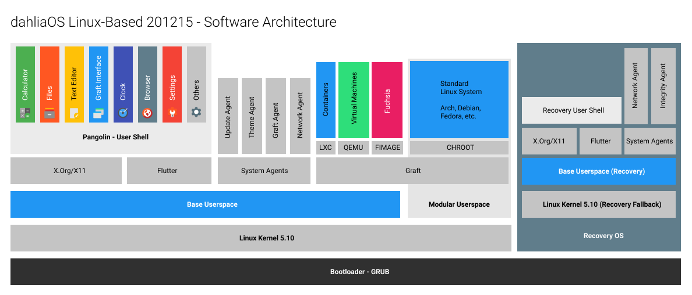
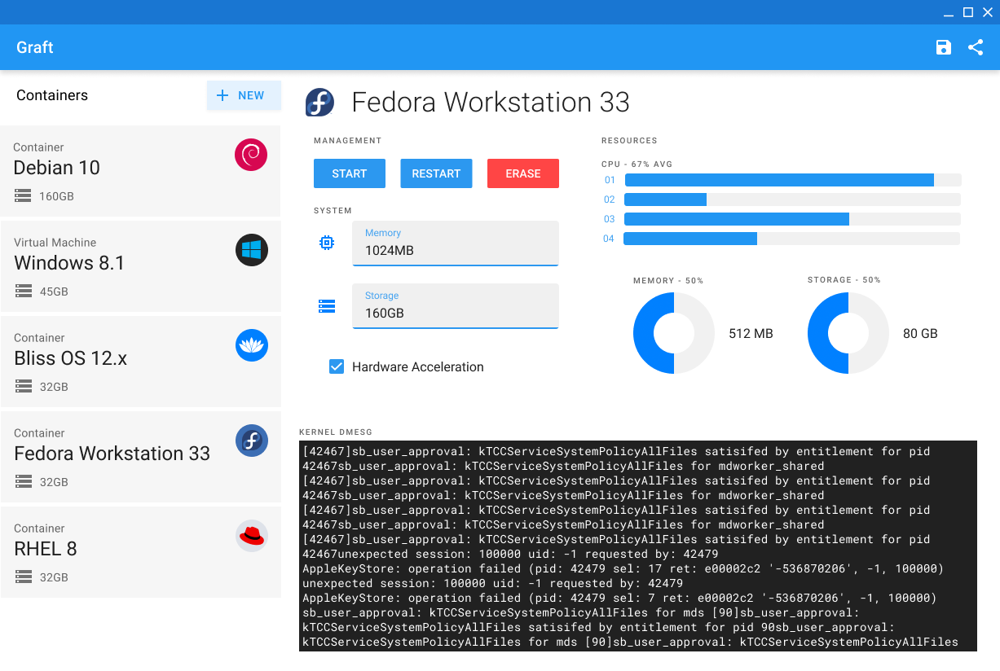
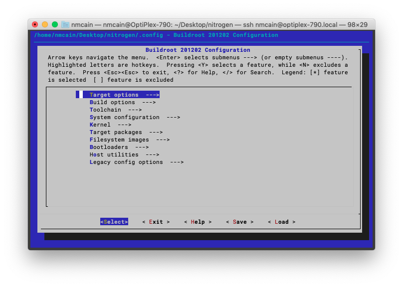

# Overview of dahliaOS Linux-based Builds
## TL;DR
You can download dahliaOS Linux [here](https://dahliaos.io/download).
## Table of Contents
- [Overview of dahliaOS Linux-based Builds](#overview-of-dahliaos-linux-based-builds)
 - [TL;DR](#tldr)
 - [Table of Contents](#table-of-contents)
 - [Running dahliaOS Linux](#running-dahliaos-linux)
   - [ARM](#arm)
     - [Raspberry Pi](#raspberry-pi)
   - [x86_64](#x86_64)
     - [AMD](#amd)
     - [Intel](#intel)
     - [Virtual Machines](#virtual-machines)
 - [The System - In-Depth](#the-system---in-depth)
   - [Agents](#agents)
   - [Security and Privacy (Upcoming)](#security-and-privacy-upcoming)
   - [Graft and the Modular Userspace](#graft-and-the-modular-userspace)
     - [Modular Userspace](#modular-userspace)
   - [Standard Linux Things](#standard-linux-things)
   - [Buildroot](#buildroot)
 - [Compiling](#compiling)
 - [Releasing](#releasing)
 - [Planned Releases (Subject to change) (WIP)](#planned-releases-subject-to-change-wip)
 
<!--<small><i><a href='http://ecotrust-canada.github.io/markdown-toc/'>Table of contents generated with markdown-toc</a></i></small>-->
 
## Running dahliaOS Linux
dahliaOS Linux is supported on a wide range of devices and emulators. For virtual machines, see the [**Virtual Machines**](linux-based.md#virtual-machines) section below.
### ARM
Currently, the Raspberry Pi 3 and the Raspberry Pi 4 (or equivalents) are the only ARM supported devices by dahliaOS Linux. The system requires the following minimum specifications:
* 1.2 GHz Broadcom BCM2837 or higher
* 256 MiB of RAM or higher
* 512 MiB of storage, 1 GiB recommended
#### Raspberry Pi
Official images are available to download from the [dahliaOS downloads page.](https://dahliaos.io/download/) We recommend [Etcher](https://www.balena.io/etcher/), but any .zip compatible flashing software should work. After flashing the SD card, use the following steps to properly configure your installation:
* Insert the flashed SD card into the Pi and power it on
* Change the root password to something secure with the `passwd` command
* Expand the filesystem onto the SD card using the `expand-fs` command


The system is now able to be used at its full capacity. Have fun!
### x86_64
dahliaOS Linux has extensive support for the x86_64 platform, and leverages its power to create a stable, efficient system on every device.
#### AMD
dahliaOS Linux can boot on AMD hardware but may require an NVIDIA GPU in order to get full graphics acceleration. The system requires the following specifications on AMD devices:
* AMD Athlon 64 or newer, 1.0 GHz or higher
* UEFI or Legacy bootloader
* 512 MiB of RAM or higher
* 512 MiB of storage, 1 GiB recommended
* NVIDIA 7800GT 256 MB or newer (Modern AMD GPUs may work but stable performance isn't guranteed)
#### Intel
dahliaOS is completely supported on the Intel platform and can run with advanced hardware acceleration (60 FPS mode). The system requires the following minimum specifications on Intel devices:
For Intel devices:
* 64-bit single-core or higher CPU, 1 GHz or higher
* UEFI or Legacy bootloader
* 512 MiB of RAM or higher
* 512 MiB of storage, 1 GiB recommended
* Intel GMA 4500 or better, Intel HD 4000 recommended, NVIDIA 7800GT 256MB or newer
#### Virtual Machines
dahliaOS is supported on a few different software-backed emulators, including QEMU and Virtualbox. A legacy image is needed to boot dahliaOS in a VM. As we are unable to afford VMWare, we can not make any inferences about performance or settings. For Virtual Machines, the following specifications are required:
* 1 or more CPU cores
* 512 MiB of RAM or higher
* No internal storage disk
* Legacy bootloader
For launching in QEMU, use the following command with a compatible Legacy image:
```bash
qemu-system-x86_64 --enable-kvm -m 4096 -cdrom <legacy>.iso
```
This will start the legacy image in QEMU with KVM (Kernel-based Virtual Machine) enabled, with 4096 MiB of RAM, booting the legacy ISO. If you are on a Windows host, remove the `--enable-kvm` flag, as it does not apply to the Windows platform.
## The System - In-Depth

Although Linux and Zircon could not be more different, dahliaOS Linux blends the security, efficiency, and virtualization capabilities of Zircon with a lightweight Linux base system.
### Agents
Agents are simple, modular executables designed to run in the background and manage the system's capabilities. In the 201215 system release, the following Agents are present:
* **Update Agent** - Checks for system updates and installs them
* **Theme Agent** - Handles global application theming
* **Graft Agent** - Manages virtualized systems running under Graft
* **Network Agent** - Manages network interfaces and connections
### Security and Privacy (Upcoming)
NOTE: The following features will be included in further releases, and are not yet present in current public releases for development and debugging purposes.
Unlike standard desktop distributions, dahliaOS employs aggressive security measures similar to the methods found on mobile systems. Major steps are taken to ensure security and privacy for all users while keeping the system open and accessible to developers.
The system is secure every step of the way, from the first boot to system shutdown, using a policy called Cerberus. Like the creature from ancient mythology, Cerberus guards the system and has three central tenets of security:
* **Verification** - The system is checked on boot and all applications are signed
* **Encryption** - User and Application data is encrypted in a secure partition to prevent data loss and leakage
* **Isolation** - The system partition and applications are all isolated from each other, and no two applications can share information or vulnerabilities without user consent.
A set of two partitions will be used to ensure maximum system security, a read-only stateless partition, where system files and executables are stored, and an encrypted stateful partition where user data remains persistently.
The `dm-verity` tool is used to verify the system and alert the user if the system is compromised. If a breach of the root file system occurs, the stateless partition can be recovered from Recovery Mode, without touching the user data on the stateful partition.
Within the system, the read-only nature of the root filesystem and the encryption of user data ensures that malicious or unsigned applications and modules can not wreak havoc on the system. The stateful partition can only be decrypted using the Decryption Agent, so any attempts to penetrate it will not go unnoticed.
Using total sandboxing, non-system applications are not allowed to interact with hardware, software, and files without explicit permission from the user. In the case of hardware usage, software-side indicators will alert the user that a camera or microphone is active, or if a task is using network access in the background.
For those living on the edge or those looking to debug the underlying system, a Developer Mode is available that will disable most of the security features of the system and make the stateless partition read/write.
### Graft and the Modular Userspace

Graft is the system's hub for installing virtualized and guest operating systems on top of dahliaOS Linux.
 
There are 4 methods of virtualizing guest systems on dahliaOS with Graft:
 
* **Containers** - More secure, runs directly on dahliaOS using the host kernel but isolated from hardware (Minimal overhead)
* **Virtual Machines** - Uses CPU self-virtualization to run directly on the hardware. (Medium overhead)
* **Emulators** - Full hardware virtualization, including processor (High overhead)
* **Chroots** - Less secure, runs directly on hardware alongside dahliaOS, uses the host kernel, see **Modular Userspace** for more information (Minimal overhead)
 All of these methods are centralized in Graft, and the virtualization mode will change according to the type of system. Currently, only Linux-based operating systems can run in Containers and Chroots.
#### Modular Userspace
In order to maintain security while ensuring that the system remains accessible to developers, dahliaOS Linux is able to run a second Linux distribution as it's userspace, booted on top of the latest Linux kernel provided by dahliaOS. The userspace can be hot-swapped within the Graft app. By default, in 201215 the default userspace is Arch.
### Standard Linux Things
While the base system is not typically accessible outside of Developer Mode, dahliaOS Linux is a fairly standard system, package-wise. The default package manager  (Used for system updates) is `rpm`, and the [Busybox](https://busybox.net) packages provide the init system and the core utilities.
### Buildroot


dahliaOS Linux is compiled using the [Buildroot](https://buildroot.org) tool, a lightweight Makefile-based embedded Linux configurator. The dahliaOS Buildroot can be found in the [Buildroot repo](https://github.com/dahliaos/buildroot). Builds are completely reproducible using the tool, and the build source used in release is typically pushed every 2-5 days.
## Compiling
Compiling dahliaOS Linux with the [Buildroot](https://github.com/dahliaos/buildroot) tool is very simple, but requires a decent amount of processor power. The following specs are required:
* Intel Core i5-2400 3.4 GHz or better - Xeon recommended
* 8 GiB of RAM or more
* Gigabit Ethernet connection
* 64 GiB of free space - 500 recommended
* Fedora Linux 33 or equivalent
 
[Read more at the Buildroot Repo >](https://github.com/dahliaos/buildroot)
## Releasing
dahliaOS Linux follows a release schedule dictated by the guidelines below. Each release must be at least 75% feature-complete to qualify as a separate release.
 
Internal experimental builds that represent major overhauls of the base system are referred to by the name `nitrogen`. As of dahliaOS 201215, there have been 3 revisions of Nitrogen:
 
* **Nitrogen I** - Initial Linux-Based test build
* **Nitrogen II** - Initial persistence testing build
* **Nitrogen III** - Initial base for dahliaOS 201215, with virtualization and wireless networking support
 
In [dahliaOS Linux-based 200305.1](https://github.com/dahliaos/releases/releases/tag/200305.1-x86) (Nitrogen I) and higher, individual builds are identified with the build ID format YYMMDD.HF, where:
 
* **YYMMDD** identifies the date when the release is branched from or synced with the development branch. It's not always the exact date at which a build was made as it's common for minor variations added to an existing build to re-use the same date code as the existing build.
* **HF** is an optional number that identifies a hotfix on top of an existing YYMMDD build, starting from 1
## Planned Releases (Subject to change) (WIP)
This list is preliminary and subject to change. The full project board can be seen [here](https://github.com/orgs/dahliaos/projects/6).
